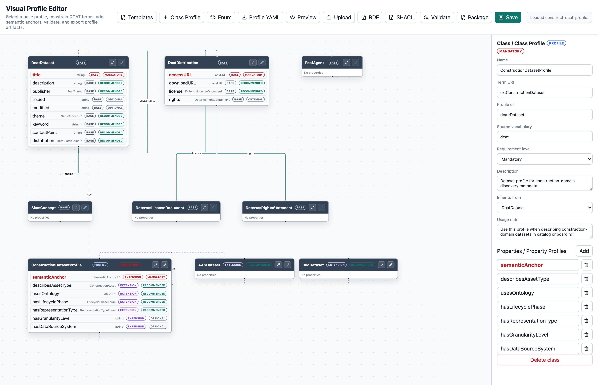

# Visual Profile Editor

A visual semantic application profile editor for extending DCAT/DCAT-AP with construction-domain metadata constraints using LinkML, SHACL, JSON Schema, and RDF.

## Introduction



The editor supports reuse-first profile engineering: users start from DCAT/DCAT-AP classes, add Construct-DCAT constraints, inspect semantic anchors and dataset extensions such as AAS and BIM datasets, and export profile artifacts from the same visual model.

This repository is a specialized profile-editor application built from the generic [`General-Ontology-Editor`](https://github.com/jundahuang9123/General-Ontology-Editor). The general editor provides the reusable visual schema/ontology editing foundation, while this repository specializes the workflow for Construct-DCAT and construction-domain dataset discovery.

The tool is designed for metadata interoperability workflows where users need to reuse, constrain, and extend existing vocabularies such as DCAT, DCAT-AP, DCTERMS, SKOS, PROV, AAS, IFC/BOT, and construction-domain vocabularies.

Instead of functioning as a full OWL ontology engineering environment, this application focuses on practical semantic profile development: visual class/property profile editing, cardinality and requirement constraints, LinkML source generation, SHACL validation export, JSON Schema generation, RDF/Turtle export, and profile package generation.

Typical use cases include:

- creating a DCAT-compatible construction-domain metadata profile;
- extending DCAT/DCAT-AP for AAS, BIM, RDF/OWL, IFC, tabular, and hybrid construction datasets;
- defining reusable metadata constraints for dataspace onboarding;
- adding semantic anchors from datasets to ontologies, SKOS concepts, AAS submodels, IFC entities, and controlled vocabularies;
- importing existing RDF/OWL/SHACL/LinkML resources and turning them into editable profile models;
- exporting SHACL, JSON Schema, LinkML, and RDF artifacts from one visual model.

## Repository Relationship

`Visual Profile Editor` depends on `General-Ontology-Editor`. Construct-DCAT-specific templates, validation rules, examples, terminology, and export packaging live in this repository only.

For local development with both repositories side by side:

```bash
python -m pip install -e ../General-Ontology-Editor
python -m pip install -r backend/requirements.txt
```

For stable downstream releases, pin `general-ontology-editor` to a Git tag or exact commit after the upstream package API is published.

## Start The App

```bash
docker compose up --build
```

Then open:

- Profile editor: `http://localhost:8000/`
- API docs: `http://localhost:8000/docs`
- Health: `http://localhost:8000/health`

## Profile Workflow

1. Select a base profile template.
2. Reuse and constrain DCAT/DCAT-AP terms.
3. Add construction-domain semantic anchors.
4. Validate the profile model.
5. Export SHACL, JSON Schema, RDF, LinkML, or a complete Construct-DCAT profile package.

## Useful Endpoints

- `GET /api/profile/model`
- `GET /api/profile/templates`
- `POST /api/profile/templates/{template_id}/load`
- `POST /api/profile/validate`
- `GET /profile/export/package`
- `GET /schema/export/shacl`
- `GET /schema/export/rdf`

The legacy dataset onboarding demo routes remain available:

- `POST /validate`
- `POST /export/jsonld`
- `POST /export/turtle`

## Project Structure

```text
visual-profile-editor/
  backend/      FastAPI app and Construct-DCAT profile routes
  frontend/     React + TypeScript profile editor UI
  profiles/     profile templates and example metadata
  schemas/      active LinkML profile source
  scripts/      artifact generation
  generated/    generated JSON Schema and SHACL files
```

## Requirement Extraction & Reuse Recommendation

The workbench includes a separate `requirement-reuse-service` container for semi-automated, reuse-first profile engineering from heterogeneous artifacts.

Initial supported inputs:

- textual requirements and competency questions;
- AAS JSON and `.aasx` packages with submodels, semantic IDs, concept descriptions, and `idShort` patterns;
- existing DCAT/RDF/JSON-LD metadata examples;
- lightweight IFC snippets for schema, class, and property-set discovery.

The frontend exposes workflow tabs for profile editing, requirement extraction, reuse recommendations, validation, and export. Requirement results are always reviewable: users accept or reject recommendations before generating SHACL/profile drafts.

Service endpoints are proxied through the main app under:

- `POST /api/requirements/analyze-artifacts`
- `POST /api/requirements/extract-requirements`
- `POST /api/requirements/recommend-reuse`
- `POST /api/requirements/generate-shacl`

The service itself remains independently deployable on port `8010`.
